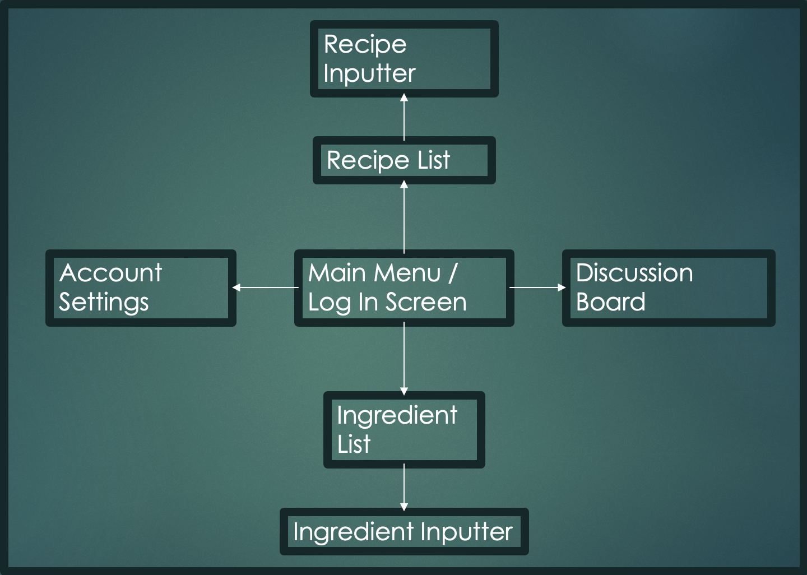
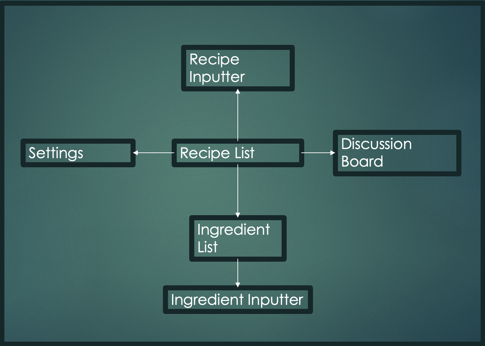
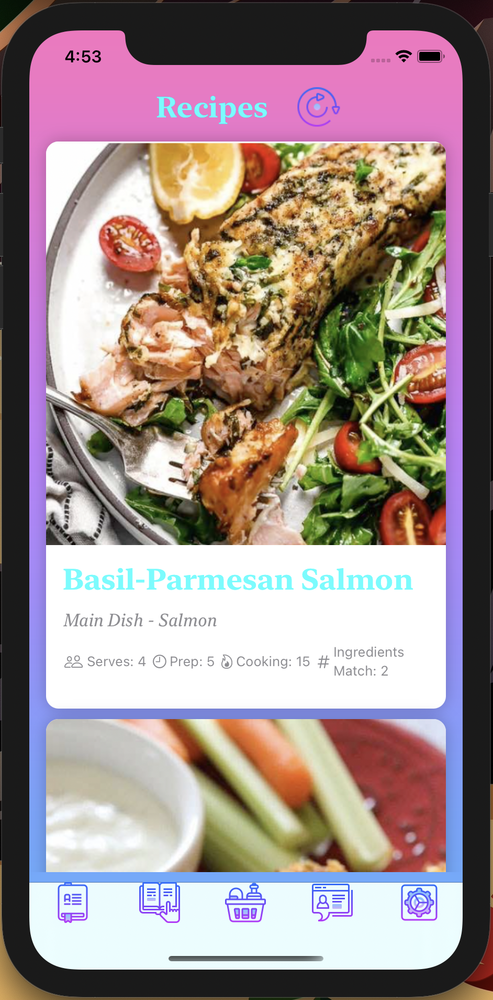

# **Mission: Recipe**  
# **MegaJ**  
# **Jaidin Jackson, Joshua Gray, Megan Stanton**  

### Introduction
Our project is a mobile application that will be a recipe database. In the database, you will be able to put in your ingredients that you currently have in your fridge or pantry, and the app will tell you which recipes you can make. The motivation for the project is to take the stress out of the kitchen and reduce food waste.  
There are similar apps on the market: SuperCook and CookList. Ours would be very similar (input ingredients, suggest recipes, possibly include an expiration date feature). However, we would include a social aspect that would allow users to add their own recipes and share with others on the app. We would also provide the option for users to make their recipes public, allowing their personal creations to be added to the pool of recipes our app can choose from. All three of our team members are computer engineering majors, and have varying levels of experience working on mobile applications. We are all hoping to gain experience with app development throughout the duration of this project. 
Throughout development, we ran into some issues relating to our inexperience making mobile applications. We were unable to implement the social aspect of our design. We successfully implemented being able to add the user ingredients and recipes to the app. However, we were also unable to figure out how to save the inputs when the application was closed. We had hoped to add user accounts to the application to save recipes and ingredient lists too, but that was another hurdle we were unable to overcome. 
We did learn a lot when it came to IOS application development, using swift, and how to design the user interface. We were able to accomplish a lot of our goals pertaining to inputting recipes and sorting by number of ingredients in the pantry. It was more difficult to implement many of our ideas than we expected, which caused delays in development. Overall, we were happy with the prototype we were able to create, and believe that with further improvements, the application could be a real competitor in the future. 

### Customer Value
There was no change from our project proposal to our final report for customer value.
Our primary customer will be home chefs or college students that are looking to save money by using the ingredients that they currently have at home. The customer wants to be able to save money, and also eat healthier by making home cooked meals. By creating this application, we are hoping to reduce food waste and create an application for storing recipes. There are currently applications that allow you to compare your ingredients to recipes, but none of the applications allow you to input your own recipes. We also want to implement a social aspect, where people can share tips and tricks that they have found when making their recipes. This social aspect would also allow them to share their recipes.   
From the customer's POV, our solution will deliver a mobile application that has the aforementioned attributes. The customer will be able to reduce their food waste, which will allow them to save money. Our solution is similar to other mobile applications, but it has some outlying characteristics that will provide useful to the customer. For example, the social aspect and also the ability to input your own recipes are both new characteristics. Many of our classmates seemed to like the idea when we proposed it in class.  
To measure our success, we will have a completed mobile application that allows the user to input recipes and ingredients. We would like to have stretch goals of adding the social aspect as well as expiration dates for ingredients. The expiration dates would allow sorting recipes by ingredients about to expire to further save money.

### Technology
Our software will be a mobile application coded in Swift using XCode. It will have a user interface that allows for the inputting of recipes and ingredients. It will also have a sorting option to sort by most ingredients available or by other nutritional topics, such as calories. In terms of stretch goals, or possible enhancements, would be to add a social aspect. This social aspect would allow the user's to share their recipes, and also tips and tricks about different cooking techniques.  We have five main components of our application. These components include a main menu, the recipe list, the ingredient list, account settings tab, and a discussion board. The main menu will allow the user to log in so that they can view and edit their recipes. They will also be able to view any other users’ recipes, but they will only be able to edit their own recipes. Other users will be able to make comments on other user's recipes using the discussion board feature. The high-level block diagram is included below. 

#### Minimal Viable System
In terms of the bare minimum, our system will allow for the inputting of recipes into a database that stores them, but does not allow for editing. This system would also allow for the inputting of ingredients. The bare minimum system would be able to display the recipes that are able to be created with those ingredients.  

#### Tools and Testing
In terms of technology, we will be using the coding language Swift. We will also be using XCode to code in and utilize the emulator. We will have an emulator that will allow us to test different aspects of our application. It will enable us to view the app as if it were on a phone. This would further allow us to input recipes and ingredients and test our algorithms.
We were able to utilize XCode’s emulation feature to test our application. XCode also has a feature that allows you to preview what each view would look like before you compile it all together. We ran into many issues that we were able to catch using the emulator. Below in Test 1, a recipe was successfully inputted into the application. In Test 2, an ingredient was successfully inputted into the application. We tested many features using the emulator, including changing tabs, refreshing screens, and closing and opening the application. Without the emulator, we would not have been able to catch nearly as many errors before transferring to the physical phone.
#### Diagram for Architecture

#### Final Diagram for Architecture

#### Test 1: Inputting a Recipe

#### Test 2: Inputting Ingredients

### Team
Joshua Gray has some experience working with Swift and XCode to create a mobile application. Jaidin Jackson and Megan Stanton have experience working with XCode but are new to Swift. We will most likely take a free online course in Swift in order to learn the tools needed to create the application. Jaidin Jackson and Megan Stanton also have experience creating user interfaces. Joshua Gray has experience making web sites, which will be useful when creating the social aspect of our app.

#### Roles:
The roles in parenthesis did not rotate. We did help each other with debugging and other tasks. Many of the tasks required us to work separately, but we worked together when possible.  
##### Joshua Gray (Experienced Programmer)  
*Sorting Algorithms
*App Layout Code
##### Jaidin Jackson (User Advocate)  
*UI design
*Settings Tab Code
##### Megan Stanton (Project Manager)  
*Ingredient View Code
*Recipe View Code
*User Input Interface

Overall, we all contributed equally to the project. Megan did a lot of the coding, but Joshua helped a lot with debugging as he had the most experience, and Jaidin designed most of the application and helped where needed. We tended to work separately, except for when design decisions needed to be made, or when one team member was stuck and required assistance.

### Project Management
Original Schedule:
We will meet weekly on Zoom.
* Week 1 (2/15 - 2/19) - Revise Project Proposal
* Week 2 (2/22 - 2/26) - Begin work on basic application
* Week 3 (3/1 - 3/5) - Implement the inputting of recipes and ingredients (Submit Status Report 1)
* Week 4 (3/8 - 3/12) - Implement sorting algorithm for different characteristics
* Week 5 (3/15 - 3/19) - Continue work on sorting algorithm (Submit Status Report 2)
* Week 6 (3/22 - 3/26) - Continue work on sorting algorithm
* Week 7 (3/29 - 4/2) - Implement social media aspect of application (Submit Status Report 3)
* Week 8 (4/5 - 4/9) - Refine application, begin work on project report
* Week 9 (4/12 - 4/16) - Finish project report and presentation

Actual Schedule:
We met when needed.
* Week 1 (2/15 - 2/19) - Revise Project Proposal
* Week 2, 3, 4, and 5 (2/22 - 3/19) - Complete Swift Course
* Week 6 (3/22 - 3/26) - Implement Basic Layout of Application
* Week 7 (3/29 - 4/2) - Implement Design of Various Views
* Week 8 (4/5 - 4/9) - Implement Inputting of Recipes and Ingredients
* Week 9 (4/12 - 4/16) - Implement Sorting Algorithm 
* Week 10 (4/17 - 4/23) - Finish project report and presentation
Unfortunately, due to how long the swift course took to complete, we were unable to meet a lot of our deadlines. We were unable to meet most of the goals for our project because we fell so far behind initially with the swift coding language course. After we completed the course, we were able to implement most of the application very quickly, and remained on time with the new schedule.

#### Constraints:
We currently do not have any regulatory or legal constraints. We also do not have any ethical or social concerns. We will have to store passwords, but none of the information contained in our application will be private, and so there should not be a need for high security. 

#### Resources:
We will have access to the data we need. All three of us have family recipes that we can use to implement the application. We will also implement a base database of recipes for clients that do not have recipes to input, but would still like to use our application.

#### Descoping & Risks:
Our main concern is not having enough time to add the social part of the app. If we cannot do so, the reduced functionality of the application will still be useful in minimizing food waste. Secondly, even if we cannot implement sorting by expiration dates, having the ability to input ingredients and produce possible recipes will still be a useful application. The basic application that we would like to implement is to be able to input ingredients and recipes. The application would also display recipes that are possible with those ingredients, and would be sorted by recipes that contain the most number of owned ingredients.

### Reflection
In terms of planning, we underestimated the amount of time that the swift coding language course would require. We were unable to start building our application until we had finished the course. After we completed the course, we were able to complete the basic attributes that we wanted to implement in our application. Development went better than expected, but ran into hurdles in the middle of implementation that would have required a complete redesign in order to implement several of the features we wished to include. We decided to stick with implementing the basic design and leave the stretch goals unfinished. 
Testing went extremely well in terms of the items we were able to implement. The emulator through XCode helped us to determine any logic errors in terms of movement through the application. We would have never realized many of the errors that corresponded to tapping the screen or scrolling without using the emulator. Team management was also a strong point in our project. We were able to communicate effectively with each other and make sure that we knew when each other were working on the project. This allowed us to make sure we did not make any changes without having pulled from GitHub. 
We consider this project a success because we did not have any experience with app development before, and we were able to create a fully functional application. While we were not able to implement all of the features that we wanted initially, we were able to create an application that provides the basic functionality that would appeal to our customers. The application is also a very good base for future development in the event that we would like to build off of it. 
