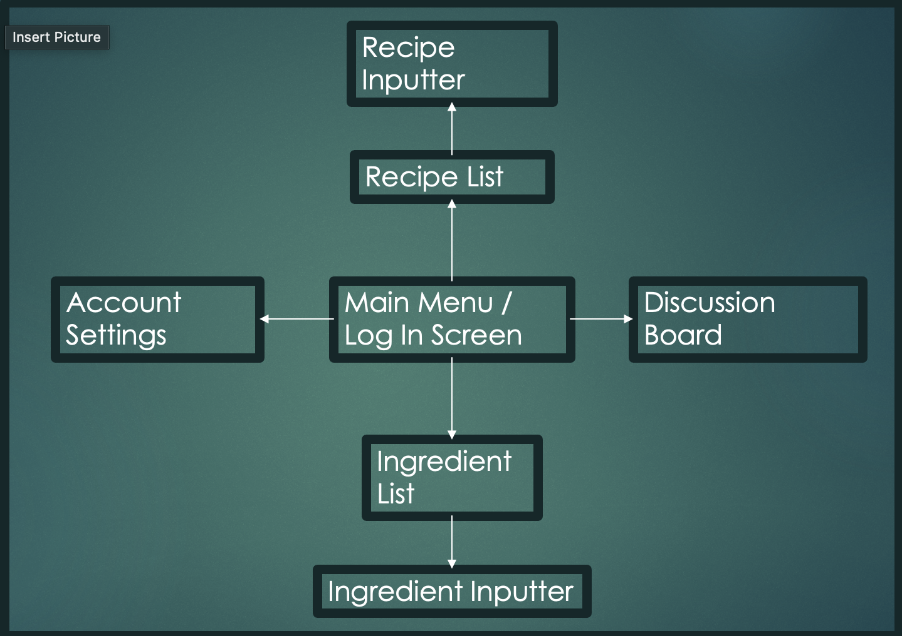

# **Mission: Recipe**  
# **MegaJ**  
# **Jaidin Jackson, Joshua Gray, Megan Stanton**  

### Introduction
Our project is a mobile application that will be a recipe database. In the database, you will be able to put in your ingredients that you currently have in your fridge or pantry, and the app will tell you which recipes you can make. The motivation for the project is to take the stress out of the kitchen and reduce food waste.  
There are similar apps on the market: SuperCook and CookList. Ours would be very similar (input ingredients, suggest recipes, possibly include an expiration date feature). However, we would include a social aspect that would allow users to add their own recipes and share with others on the app. We would also provide the option for users to make their recipes public, allowing their personal creations to be added to the pool of recipes our app can choose from. All three of our team members are computer engineering majors, and have varying levels of experience working on mobile applications. We are all hoping to gain experience with app development throughout the duration of this project. 

### Customer Value
Our primary customer will be home chefs or college students that are looking to save money by using the ingredients that they currently have at home. The customer wants to be able to save money, and also eat healthier by making home cooked meals. By creating this application, we are hoping to reduce food waste and create an application for storing recipes. There are currently applications that allow you to compare your ingredients to recipes, but none of the applications allow you to input your own recipes. We also want to implement a social aspect, where people can share tips and tricks that they have found when making their recipes. This social aspect would also allow them to share their recipes.   
From the customer's POV, our solution will deliver a mobile application that has the aforementioned attributes. The customer will be able to reduce their food waste, which will allow them to save money. Our solution is similar to other mobile applications, but it has some outlying characteristics that will provide useful to the customer. For example, the social aspect and also the ability to input your own recipes are both new characteristics. Many of our classmates seemed to like the idea when we proposed it in class.  
To measure our success, we will have a completed mobile application that allows the user to input recipes and ingredients. We would like to have stretch goals of adding the social aspect as well as expiration dates for ingredients. The expiration dates would allow sorting recipes by ingredients about to expire to further save money.

### Proposed Solution & Technology
Our software will be a mobile application coded in Swift using XCode. It will have a user interface that allows for the inputting of recipes and ingredients. It will also have sorting option to sort by most ingredients available or by other nutritional topics, such as calories. In terms of stretch goals, or possible enhancements, would be to add a social aspect. This social aspect would allow the user's to share their recipes, and also tips and tricks about different cooking techniques. We will have an emulator that will allow us to test different aspects of our application. It will enable us to view the app as if it were on a phone. This would further allow us to input recipes and ingredients and test our algorithms.  
In terms of technology, we will be using the coding language Swift. We will also be using XCode to code in and utilize the emulator.

#Diagram for Architecture

### Team
Joshua Gray has some experience working with Swift and XCode to create a mobile application. Jaidin Jackson and Megan Stanton have experience working with XCode but are new to Swift. We will most likely take a free online course in Swift in order to learn the tools needed to create the application. Jaidin Jackson and Megan Stanton also have experience creating user interfaces. Joshua Gray has experience making web sites, which will be useful when creating the social aspect of our app.

Roles:
* Jaidin Jackson: User Interface
* Joshua Gray: Debug code since he has the most experience with Swift, and also work on the inputting function of the application
* Megan Stanton: Sorting Algorithms and other portions of the application

### Project Management
Schedule:
We will meet weekly on Zoom.
* Week 1 (2/15 - 2/19) - Revise Project Proposal
* Week 2 (2/22 - 2/26) - Begin work on basic application
* Week 3 (3/1 - 3/5) - Implement the inputting of recipes and ingredients (Submit Status Report 1)
* Week 4 (3/8 - 3/12) - Implement sorting algorithm for different characteristics
* Week 5 (3/15 - 3/19) - Continue work on sorting algorithm (Submit Status Report 2)
* Week 6 (3/22 - 3/26) - Continue work on sorting algorithm
* Week 7 (3/29 - 4/2) - Implement social media aspect of application (Submit Status Report 3)
* Week 8 (4/5 - 4/9) - Refine application, begin work on project report
* Week 9 (4/12 - 4/16) - Finish project report and presentation

Constraints:
We currently do not have any regulatory or legal constraints. We also do not have any ethical or social concerns.

Resources:
We will have access to the data we need. All three of us have family recipes that we can use to implement the application. We will also implement a base database of recipes for clients that do not have recipes to input, but would still like to use our application.

Descoping:
If we cannot implement the social media aspect, the reduced functionality of the application will still be useful in reducing food waste. Even if we cannot implement sorting by expiration dates, having the ability to input ingredients and produce possible recipes will still be a useful application. The basic application that we would like to implement is to be able to input ingredients and recipes. The application would also display recipes that are possible with those ingredients, and would be sorted by recipes that contain the most number of owned ingredients.
